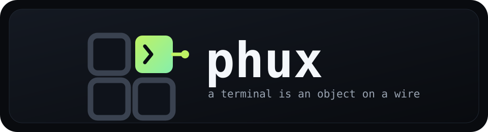

<!--
audience: humans, contributors, agents
stability: stable
last-reviewed: 2026-08-02
-->

<div align="center">



# phux

**the tmux job, done - a terminal is an object on a wire**

[](https://github.com/phall1/phux/actions/workflows/ci.yml)
[](#license)

[Install](#install-and-run) |
[Keys](#keys-you-need-first) |
[Config](#settings-and-config) |
[Headless](#headless-and-agent-control) |
[Agent Workbench](#agent-workbench) |
[Troubleshooting](#troubleshooting) |
[Status](#status) |
[Docs](#where-to-go-from-here)

</div>


<div align="center">
<sub>

Recorded and rendered by the binary it demonstrates -- `phux rec`,
no asciinema, no ffmpeg. ([Recording](docs/consumers/recording.md))

</sub></div>

phux is a terminal multiplexer, like tmux or screen: your shells live in a
background server, you split them into panes, you detach, and everything is
still running when you come back.

The twist is what a "terminal" is. In phux, each pane is a real terminal
emulator living inside the server, and anything can attach to it -- the
bundled TUI, a shell script, an AI agent. They all hold the same live
terminal at the same time, with the same authority. No screen-scraping, no
"agent mode": to a program, a phux terminal is just an object it can type
into, read from, and wait on.

## Quick start

```sh
brew install phall1/tap/phux
phux
```

You're in a shell. `Ctrl-A d` detaches, `phux` brings you back, `Ctrl-A ?`
shows every key. Prebuilt binaries cover macOS arm64, Linux x86_64, and Linux arm64;
Windows is not supported. Other channels and source builds:
[INSTALL](./docs/INSTALL.md).

Interactive entry points require terminal stdin and stdout. For redirected
work, use the headless commands below; they never need a TTY.

The same terminals work without a TTY, from scripts, CI, or an agent:

```sh
phux send-keys . 'cargo test' Enter   # type into the focused pane
phux wait --until "0 failed" .        # block until output appears
phux snapshot .                       # read the screen
phux agent explain .                  # what is the agent in this pane doing?
```

There's an MCP server too (`phux-mcp`), so agent hosts get the same verbs
as tools. Start at [Agents](./docs/consumers/agents.md).

## How it works

```text
      your programs: zsh, vim, htop, an agent's shell
                          │
                          │  PTY
                          ▼
 ┌─────────────────────────────────────────────────┐
 │ phux server -- keeps running when you leave     │
 │                                                 │
 │ libghostty terminal: the real one. Screen,      │
 │ scrollback, and modes live here, so they        │
 │ survive detach and feed headless reads.         │
 └───────────────┬──────────────────▲──────────────┘
                 │                  │
     output goes │                  │ input comes back
     down as raw │                  │ up as structured
     VT bytes,   │                  │ key, mouse, and
     verbatim    ▼                  │ paste events
 ┌──────────────────────────────────┴──────────────┐
 │ phux client -- attach, detach, reattach;        │
 │ several clients can share one terminal          │
 │                                                 │
 │ libghostty terminal: the same engine, fed       │
 │ the same bytes, drawing them on your screen     │
 └─────────────────────────────────────────────────┘
```

tmux-style multiplexers sit in the middle of the byte stream: they parse
your program's output into their own screen model, then re-encode it for
whatever terminal you attached from. Anything the middleman doesn't
understand -- an inline image, a new underline style, next year's protocol
-- gets mangled or dropped in translation.

phux doesn't translate. The same emulator ([libghostty][lghv], the engine
from Ghostty) runs on both ends with two different jobs. The server's copy
is the source of truth: it's what survives detach and what scripts read.
The client's copy just renders, fed the exact bytes your program wrote.
Down the wire go raw VT bytes; back up go structured key, mouse, and paste
events. Nobody in the middle rewrites anything, so this works:


<div align="center">
<sub>

Truecolor, curly underlines, and an inline image surviving detach and
reattach -- then the same session driven headlessly.

</sub></div>

## Troubleshooting

When something misbehaves, three commands answer most questions:

```sh
phux status   # is the server up: pid, uptime, protocol, clients, sessions, logs
phux doctor   # checks config, socket, server, plugins, and log paths
phux logs     # names every log file phux writes; tails any of them
```

`phux status` reports the server behind the socket in one glance -- and with
no server running says so, naming the command that starts one. `phux doctor`
runs the checks a debugging session would otherwise discover one by one and
prints one verdict per line. `phux logs` knows where every log lives, so you
never have to.

## Status

The TUI multiplexer and modern-protocol passthrough are stable enough to
try. The headless verbs, the MCP server, workspace save/restore, and
satellite federation are real and tested, still pre-1.0. A native GUI is
designed but not wired. Anything else you've heard is a direction, not a
feature.

phux also deliberately has no scripting language, no in-process plugin
host, and no homegrown crypto. The reasoning is in
[CONTRIBUTING](./CONTRIBUTING.md).

## Learn more

| | |
|---|---|
| Decide if phux fits | [When to use phux](./docs/when-to-use.md) |
| The mental model | [Concepts](./docs/CONCEPTS.md) |
| Keys and config | [Configuration](./docs/CONFIG.md) |
| Drive it from an agent | [Agents](./docs/consumers/agents.md) · [MCP](./docs/consumers/mcp.md) |
| Record and replay sessions | [Recording](./docs/consumers/recording.md) |
| Reach it over the network | [Remote access](./docs/remote-access.md) |
| The wire protocol | [Spec](./docs/spec/) · [Architecture](./docs/architecture/) |
| Where it's going | [Vision](./docs/vision.md) · [ADRs](./ADR/README.md) |
| Build it with us | [Contributing](./CONTRIBUTING.md) |

## License

Dual-licensed under [MIT](./LICENSE-MIT) or [Apache-2.0](./LICENSE-APACHE).

[lghv]: https://github.com/Uzaaft/libghostty-rs
