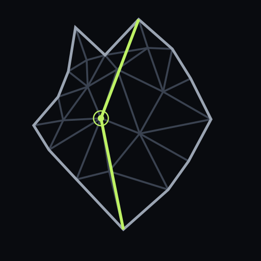

<!--
audience: humans, contributors, agents
stability: stable
last-reviewed: 2026-09-20
-->

<p align="center">
  
</p>

# phux

part of [no-phux](https://github.com/orgs/no-phux/repositories)

[Docs](https://docs.phux.sh/overview) · [Discord](https://discord.gg/dUv5rzdHp)
[](https://github.com/no-phux/phux/actions/workflows/ci.yml)
[](./LICENSE)

phux is a terminal multiplexer for terminals shared by people, apps, and
agents. Your shells live in a background server; the TUI, Cockpit, the browser,
a script, and an agent can all attach to the same live terminal.

- **One terminal, many peers.** What you see is what an agent reads and drives;
  there is no copied log or agent-only pane model.
- **Agent state can be data.** A harness emits structured lifecycle records;
  terminal detection is the compatibility path when it does not.
- **The wire is public.** Visual clients, the JSON CLI, SDK, and MCP adapter use
  the same resource protocol rather than privileged side channels.
- **Remote does not require a phux account.** `phux --remote me@mini` pairs over
  SSH once; subsequent attaches dial the machine directly over QUIC.

## tmux, Herdr, or phux?

Use **tmux** if you need a mature local multiplexer and nothing else. phux keeps
the familiar attach, split, prefix, and detach loop, but earns its extra moving
parts only when another client or an agent must share the terminal as a live,
addressable object.

Use **Herdr** if you want one integrated agent-workspace product. Herdr and phux
both keep real PTYs alive and expose agent-aware control; they put the durable
boundary in different places. Herdr projects its workspace model to its clients.
phux exposes Terminal and AgentSession resources on one wire so independently
shaped visual and headless clients remain peers.

[Choose by use case](./docs/when-to-use.md) ·
[translate tmux keys](./docs/coming-from.md) ·
[compare the Herdr architecture](./docs/architecture/phux-and-herdr.md) ·
[see measured performance](./docs/performance.md)

## Install

```sh
brew trust --tap no-phux/tap
brew install no-phux/tap/phux
```

Or use the verified release installer:

```sh
curl -fsSL https://phux.sh/install | sh
```

Release builds support macOS arm64, Linux x86_64, and Linux arm64. Windows is
not supported. For the native macOS Cockpit:

```sh
curl -fsSL https://phux.sh/install-cockpit | sh
```

For agents:

```sh
npx skills add no-phux/skills
```

Run `phux` to start. Prefix is `Ctrl-A`; `Ctrl-A d` detaches. Other channels
and source builds: [Install](./docs/INSTALL.md).

## First minute

```sh
phux                       # start the server and attach
# Ctrl-A %                 # split left/right
# Ctrl-A d                 # detach; the shells keep running
phux ls --json             # inspect the same terminals headlessly
phux snapshot default      # read the current grid without attaching a UI
```

[Quickstart](./docs/QUICKSTART.md) ·
[keys and configuration](./docs/CONFIG.md) ·
[remote access](./docs/remote-access.md) ·
[agent control](./docs/consumers/agents.md) ·
[harness emit contract](./docs/consumers/harness.md) ·
[build a client](./docs/consumers/build-a-client.md)

## License

[Apache-2.0](./LICENSE). Copyright 2026 phall.

[NOTICE](./NOTICE) · [Third-party notices](./THIRD-PARTY-NOTICES.md)
