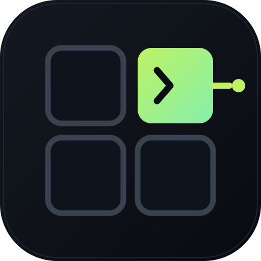

<!--
audience: humans, contributors, agents
stability: stable
last-reviewed: 2026-09-12
-->

<div align="center">



# phux

part of [no-phux](https://github.com/orgs/no-phux/repositories)

[Discord](https://discord.gg/dUv5rzdHp)

[](https://github.com/no-phux/phux/actions/workflows/ci.yml)
[](#license)

</div>

phux is a terminal multiplexer. Your shells live in a background server. You
split them into panes, detach, and they keep running. Each pane is a real
terminal emulator living in the server, so the TUI, Cockpit, a script, and an
agent can all attach to that same live terminal.

## Install

The universal one-liner:

```sh
curl -fsSL https://phux.sh/install | sh
```

Homebrew is the recommended day-to-day path on supported macOS and Linux:

```sh
brew trust --tap no-phux/tap # Homebrew 6+
brew tap no-phux/tap
brew install no-phux/tap/phux
```

```sh
phux
```

You're in a shell. `Ctrl-A d` detaches, `phux` brings you back. Prebuilt
binaries cover macOS arm64, Linux x86_64, and Linux arm64; Windows is not
supported. Other channels: [INSTALL](./docs/INSTALL.md).

## First minutes

The default prefix is `Ctrl-A`. Four continuations are enough for a first run:

| Keys | Action |
|---|---|
| `Ctrl-A ?` | Open the complete keybinding help. |
| `Ctrl-A %` | Split left and right. |
| `Ctrl-A "` | Split top and bottom. |
| `Ctrl-A d` | Detach without stopping the shell. |

`phux` reattaches. Open a *second* terminal for the commands below; the
attached session cannot run them in that TTY.

```sh
phux ls
phux snapshot .
phux send-keys . "printf '%s\n' phux-ready | tr a-z A-Z" Enter
phux wait --until "PHUX-READY" --timeout 10 .
```

Another machine, as long as it is reachable:

```sh
phux --remote me@mini
```

The first run pairs the host and remembers it; every run after that is a
direct, encrypted QUIC dial with no ssh in the path. See
[Remote access](./docs/remote-access.md).

Cockpit is the native macOS client for the same terminals:

```sh
curl -fsSL https://phux.sh/install-cockpit | sh
```

Or the Homebrew cask. Details: [INSTALL](./docs/INSTALL.md#cockpit-native-macos).

## How it works

```text
      your programs: zsh, vim, htop, an agent's shell
                          │
                          │  PTY
                          ▼
 ┌─────────────────────────────────────────────────┐
 │ phux server -- keeps running when you leave     │
 │                                                 │
 │ libghostty terminal: the real one. Screen,      │
 │ scrollback, and modes live here, so they        │
 │ survive detach and feed headless reads.         │
 └───────────────┬──────────────────▲──────────────┘
                 │                  │
     output goes │                  │ input comes back
     down as raw │                  │ up as structured
     VT bytes,   │                  │ key, mouse, and
     verbatim    ▼                  │ paste events
 ┌──────────────────────────────────┴──────────────┐
 │ phux client -- attach, detach, reattach;        │
 │ several clients can share one terminal          │
 │                                                 │
 │ libghostty terminal: the same engine, fed       │
 │ the same bytes, drawing them on your screen     │
 └─────────────────────────────────────────────────┘
```

tmux-style multiplexers sit in the middle of the byte stream: they parse
your program's output into their own screen model, then re-encode it for
whatever terminal you attached from. Anything the middleman doesn't
understand -- an inline image, a new underline style, next year's protocol
-- gets mangled or dropped in translation.

phux doesn't translate. The same emulator ([libghostty][lghv], the engine
from Ghostty) runs on both ends with two different jobs. The server's copy
is the source of truth: it's what survives detach and what scripts read.
The client's copy just renders, fed the exact bytes your program wrote.
Down the wire go raw VT bytes; back up go structured key, mouse, and paste
events. Nobody in the middle rewrites anything.

## Troubleshooting

When something misbehaves, three commands answer most questions:

```sh
phux status   # is the server up: pid, uptime, protocol, clients, sessions, logs
phux doctor   # checks config, socket, server, plugins, and log paths
phux logs     # names every log file phux writes; tails any of them
```

## Status

phux is pre-alpha. Cockpit ships. AgentSession exists in this tree
(`phux agent session open|close`, `phux agent emit`, `phux agent log`); older
brew and curl releases may not advertise it — `phux status --json` is the
check. Federation is real and limited: hub-and-spoke, selectors `host/@N`,
no merged remote session or window model. The gap table is in
[Concepts](./docs/CONCEPTS.md#status).

## Learn more

| | |
|---|---|
| Decide if phux fits | [When to use phux](./docs/when-to-use.md) |
| The mental model | [Concepts](./docs/CONCEPTS.md) |
| Keys and config | [Configuration](./docs/CONFIG.md) |
| Drive it from an agent | [Agents](./docs/consumers/agents.md) |
| Record and replay sessions | [Recording](./docs/consumers/recording.md) |
| Reach it over the network | [Remote access](./docs/remote-access.md) |
| The wire protocol | [Spec](./docs/spec/) · [Architecture](./docs/architecture/) |
| Where it's going | [Vision](./docs/vision.md) · [ADRs](./ADR/README.md) |
| Build it with us | [Setup: native or Nix, by work area](./docs/SETUP.md), then [Contributing](./CONTRIBUTING.md) |

## License

Dual-licensed under [MIT](./LICENSE-MIT) or [Apache-2.0](./LICENSE-APACHE).

[lghv]: https://github.com/Uzaaft/libghostty-rs
