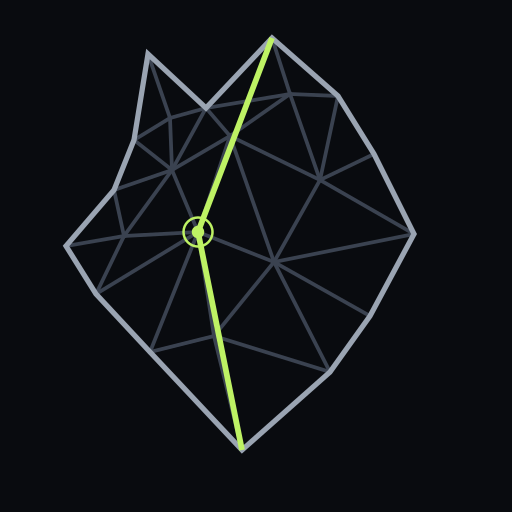

<!--
audience: humans, contributors, agents
stability: stable
last-reviewed: 2026-09-20
-->

<p align="center">
  
</p>

# phux

part of [no-phux](https://github.com/orgs/no-phux/repositories)

[Docs](https://docs.phux.sh/overview) · [Discord](https://discord.gg/dUv5rzdHp)
[](https://github.com/no-phux/phux/actions/workflows/ci.yml)
[](./LICENSE)

phux is a programmable terminal runtime. A background server keeps shells
running; public control and event interfaces let people, scripts, and coding
agents work with them across clients and machines.

- Split, detach, and reattach in the TUI, or use a native or browser client.
- Read terminal state, send input, and wait for output through the JSON CLI,
  SDK, or MCP adapter. Visual and headless clients use the same resource protocol.
- Read structured agent lifecycle records from a harness, with terminal
  detection as the fallback.
- Connect directly to remote machines: `phux --remote me@mini` pairs over SSH
  once, then attaches over QUIC. No phux account is required.

## tmux, Herdr, or phux?

Use tmux for mature terminal multiplexing. Choose phux when you also need
public terminal and agent-event interfaces, independent clients, or direct
remote attachment.

Use Herdr for an integrated agent workspace. Both systems keep real PTYs
alive and expose agent-aware control. Herdr projects its workspace model to
its clients; phux exposes Terminal and AgentSession resources for clients
with their own layouts and workflows.

[Choose by use case](./docs/when-to-use.md) ·
[translate tmux keys](./docs/coming-from.md) ·
[compare the Herdr architecture](./docs/architecture/phux-and-herdr.md) ·
[see measured performance](./docs/performance.md)

## Install

```sh
brew trust --tap no-phux/tap
brew install no-phux/tap/phux
```

Or use the verified release installer:

```sh
curl -fsSL https://phux.sh/install | sh
```

Release builds support macOS arm64, Linux x86_64, and Linux arm64. Windows is
not supported. For the native macOS Cockpit:

```sh
curl -fsSL https://phux.sh/install-cockpit | sh
```

For agents:

```sh
npx skills add no-phux/skills
```

Run `phux` to start. Prefix is `Ctrl-A`; `Ctrl-A d` detaches. Other channels
and source builds: [Install](./docs/INSTALL.md).

## First minute

```sh
phux                       # start the server and attach
# Ctrl-A %                 # split left/right
# Ctrl-A d                 # detach; the shells keep running
phux ls --json             # inspect the same terminals headlessly
phux snapshot default      # read the current grid without attaching a UI
```

[Quickstart](./docs/QUICKSTART.md) ·
[keys and configuration](./docs/CONFIG.md) ·
[remote access](./docs/remote-access.md) ·
[agent control](./docs/consumers/agents.md) ·
[harness emit contract](./docs/consumers/harness.md) ·
[build a client](./docs/consumers/build-a-client.md)

## License

[Apache-2.0](./LICENSE). Copyright 2026 phall.

[NOTICE](./NOTICE) · [Third-party notices](./THIRD-PARTY-NOTICES.md)
